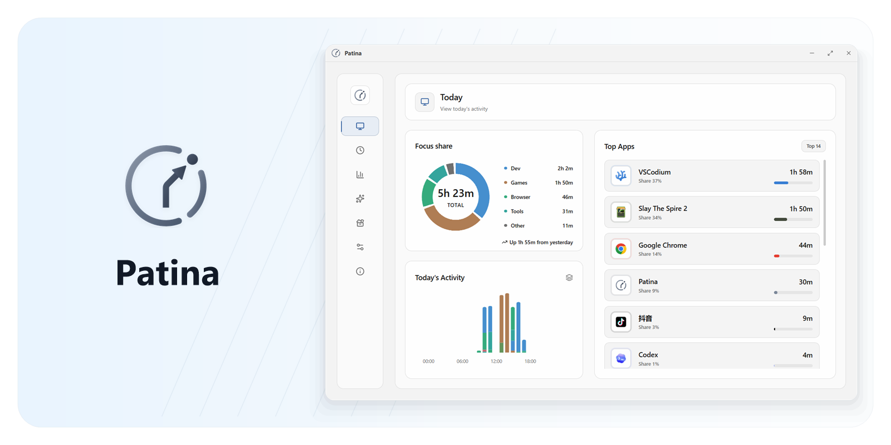
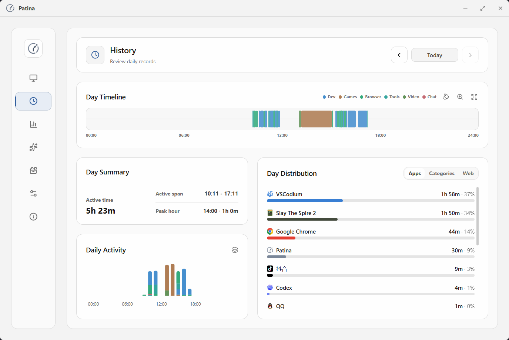
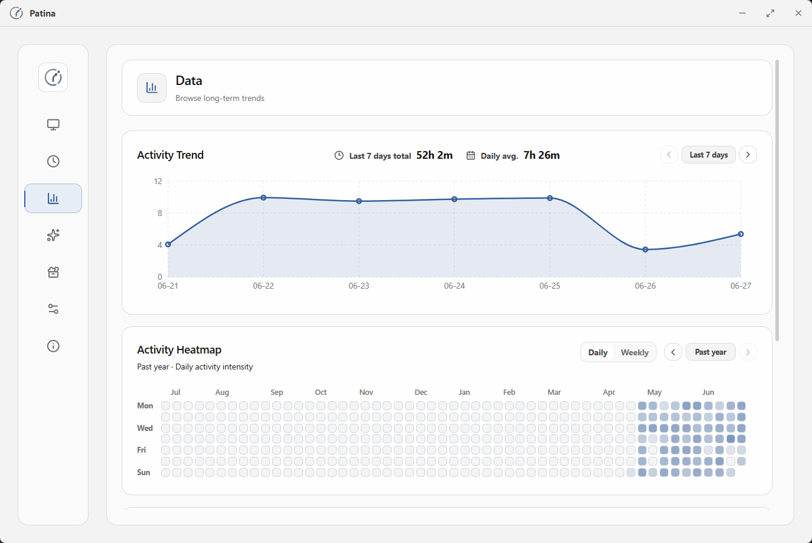
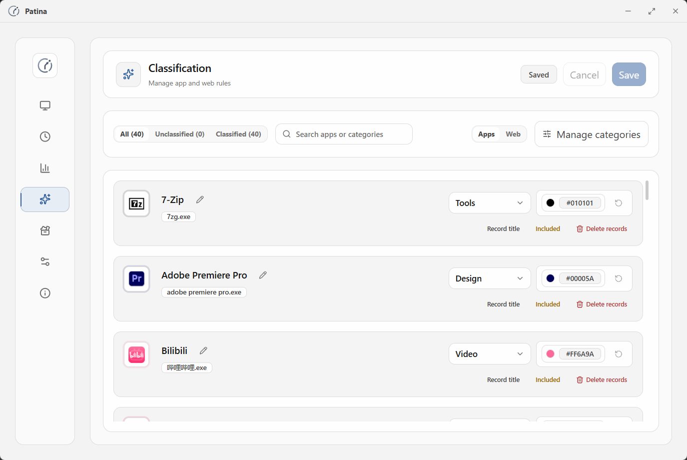
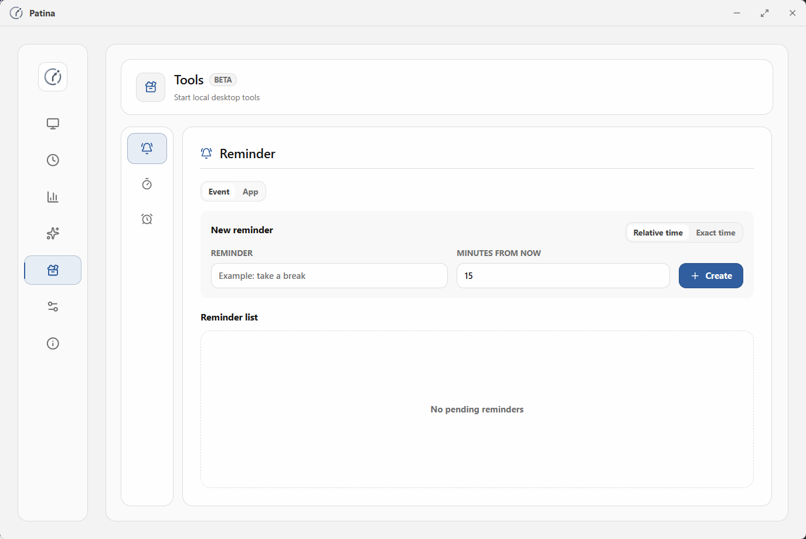
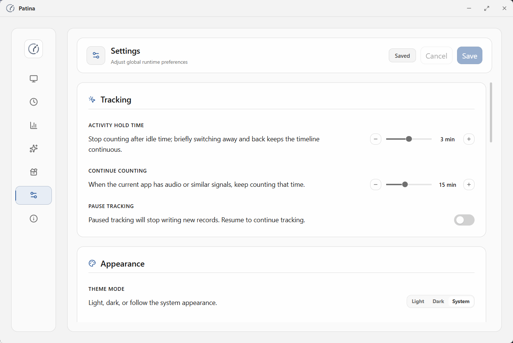
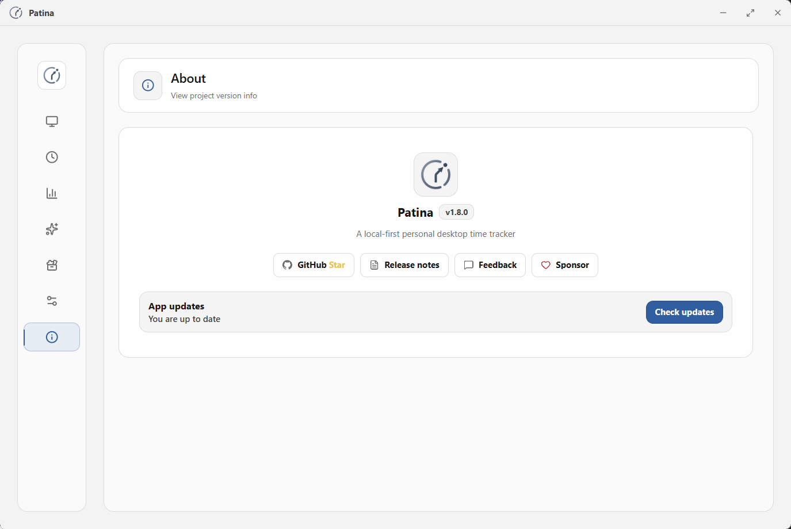
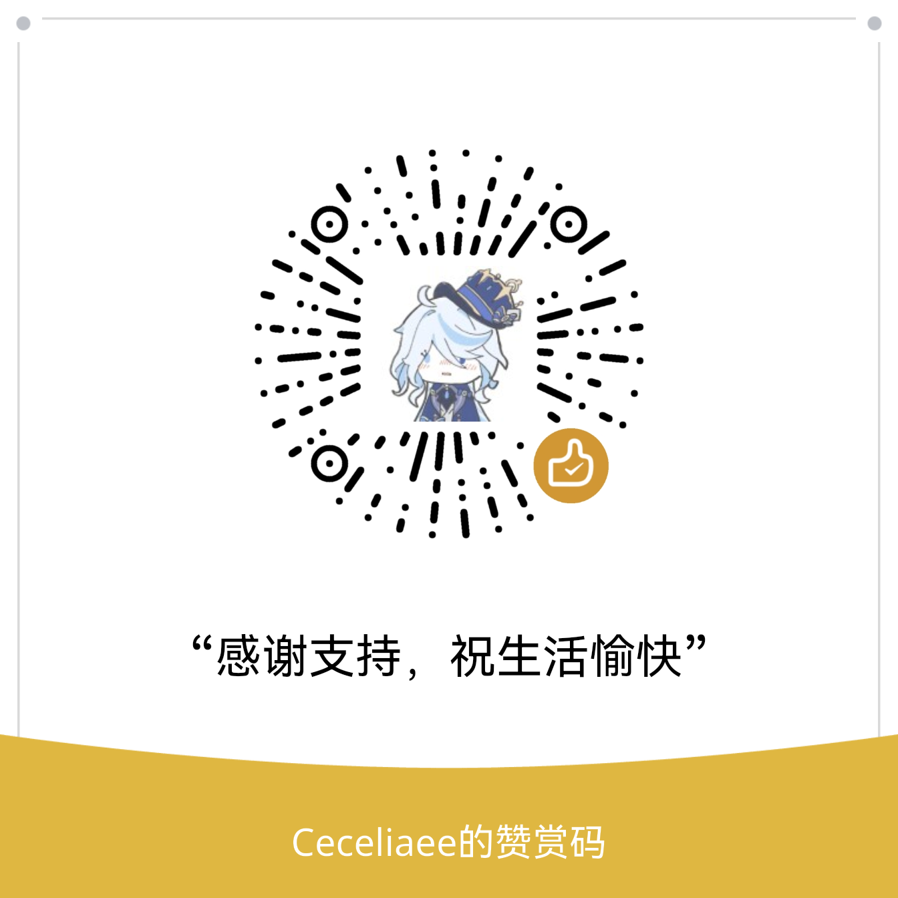

<div align="center">

# TimekeepGUI

参考项目
https://github.com/jms-guy/timekeep
https://github.com/Ceceliaee/patina
将patina的GUI和timekeep的功能结合

面向 Windows 桌面的本地优先时间管理工具。

简体中文


[](LICENSE)

</div>


<p align="center">
TimekeepGUI 将 Timekeep 的程序存在时间追踪与安静、可信的桌面时间管理界面结合起来。Timekeep 是本项目唯一的核心计时系统，其他页面只提供查看、分类、分析和辅助提醒。
</p>

## 项目定位

TimekeepGUI 是一个 Windows 桌面端时间管理项目，使用 Patina 的 Tauri/React 图形界面承载 Timekeep 的程序追踪、活动会话、历史记录和统计能力。

当前仓库的父级目录 `E:\Github\TimekeepGUI` 是实际 GUI 项目根目录。`sample/` 仅用于保存参考项目，不参与前端、Rust 或 Release 构建。

## 工作方式

GUI 通过 Rust/Tauri command 调用 Timekeep bridge。桥接层使用与 `sample/timekeep` 相同的数据库结构；如果已安装 Timekeep 服务，则通过 named pipe 通知服务刷新，否则由父级 GUI 执行同语义的进程存在同步：

```text
React/TypeScript GUI
        ↓
Tauri command: cmd_timekeep_request
        ↓
Timekeep 数据库：C:\ProgramData\TimeKeep\timekeep.db
        ↓（可选）
Windows named pipe: \\.\pipe\Timekeep → Timekeep service
```

Timekeep 服务未运行时，GUI 仍可直接根据配置的程序名称枚举当前进程并维护会话；服务运行时则由服务负责进程事件监控，GUI 只读取其活动会话。

首次使用 Timekeep 页面时，点击“添加程序”会扫描当前正在运行的 Windows 程序。勾选需要统计的程序后，可以一次性设置分类和项目并加入追踪列表；程序保持运行期间会写入活动会话，退出后会把时长写入 `session_history` 和 `tracked_programs.lifetime_seconds`。如果目标程序尚未运行，先启动它再点击“重新扫描”。

## 目录结构

```text
TimekeepGUI/
├─ src/                 React、TypeScript 和页面功能
├─ src-tauri/           Rust/Tauri 桌面端、Windows 集成和 IPC bridge
├─ tests/               前端、集成和 UI 测试
├─ scripts/             检查、生成和 Release 脚本
├─ .vscode/             推荐插件、任务和调试配置
└─ sample/              Patina/Timekeep 参考代码，不参与本项目构建
```

<p align="center">
  
</p>
## 编译调试运行方式

以下命令默认在实际 GUI 项目根目录执行：

```powershell
cd E:\Github\TimekeepGUI
```

### 前端编译

```powershell
npm ci
npm run check:types
npm run check:lint
npm run build
```

### Rust/Tauri 编译检查

```powershell
cargo check --manifest-path src-tauri/Cargo.toml --locked
cargo test --manifest-path src-tauri/Cargo.toml --locked
cargo clippy --manifest-path src-tauri/Cargo.toml --locked -- -D warnings
```

### GUI 调试运行

```powershell
npm run tauri dev
```

GUI 启动后会使用开发配置，并连接本机的 Timekeep IPC。若需要完整联调，请先在另一个终端启动 Timekeep service：

```powershell
cd E:\Github\TimekeepGUI\sample\timekeep
go run ./cmd/service --debug
```

然后在 GUI 项目终端执行：

```powershell
cd E:\Github\TimekeepGUI
npm run tauri dev
```

Timekeep service 成功运行后应监听 Windows named pipe `\\.\pipe\Timekeep`。如果服务未启动但数据库已经存在，GUI 会启用内置进程存在同步；如果数据库也不存在，请先启动 Timekeep 服务完成数据库初始化。

## 从源码构建

### 环境要求

- Windows 10/11 x64
- [Node.js](https://nodejs.org/) `25.8.0` 和 npm `11.11.0`
- [Rust](https://www.rust-lang.org/tools/install) `1.94.1` 及 `x86_64-pc-windows-msvc` 工具链
- Visual Studio C++ Build Tools 和 Windows 10/11 SDK

Node 和 Rust 版本分别锁定在 [`.node-version`](.node-version) 与 [`rust-toolchain.toml`](rust-toolchain.toml) 中。

### 安装依赖

```powershell
cd E:\Github\TimekeepGUI
npm ci
```

### 开发运行

```powershell
npm run tauri dev
```

使用 Timekeep 页面前，请先单独启动 Timekeep service。GUI 通过 Windows named pipe `\\.\pipe\Timekeep` 连接服务，不会自动启动服务。

### 构建安装包

```powershell
# 本地未签名安装包
npm run tauri -- build --bundles nsis --no-sign

# 签名安装包（需要配置 TAURI_SIGNING_PRIVATE_KEY 和
# TAURI_SIGNING_PRIVATE_KEY_PASSWORD 环境变量）
npm run tauri -- build --bundles nsis
```

安装包生成在：

```text
src-tauri/target/release/bundle/nsis/
```

签名构建还会生成 updater 签名文件 `*.exe.sig`。请将 updater 私钥保存在仓库之外，禁止提交到 Git。

## 为什么选择 TimekeepGUI

- 只要被配置的程序进程存在，就自动记录运行时长，不依赖活动窗口或窗口焦点。
- 处理无操作、锁屏、睡眠和异常退出等边界，让记录更加可信。
- 数据默认保存在本地，不依赖账号、云同步或远程服务器。
- 支持管理应用名称、分类、颜色和统计排除规则。
- 提供轻量本地提醒；独立秒表、倒计时和番茄钟不是本项目的计时入口。
- 界面保持克制、清晰、低打扰，适合长期日常使用。

## 下载

TimekeepGUI 当前版本需要从源码构建，独立 Release 页面将在项目正式发布后补充。构建方法见下方“从源码构建”章节。

Patina 的公开版本和素材仅作为本项目的参考来源，不代表 TimekeepGUI 的发行包。

[Patina Web Sync](https://github.com/Ceceliaee/patina-web-sync) 可以为浏览器活动补充具体网页信息，可按需安装：

<p align="center">
  <a href="https://chromewebstore.google.com/detail/patina-web-sync/gimdckblhckibmeklhemgccabmbnoemd"></a>
  <a href="https://addons.mozilla.org/firefox/addon/patina-web-sync/"></a>
  <a href="https://microsoftedge.microsoft.com/addons/detail/gogmlpjhbfjghilmpcciedplifdiibai"></a>
</p>

## 核心能力

### 自动追踪

- 依据进程启动和退出记录会话：首个进程启动会话，最后一个同名进程退出会话。
- 同一个程序同时打开多个进程时，只要还有一个进程存在，会话就会继续计时。
- 计时由 Timekeep 后台服务负责，GUI 关闭或隐藏到托盘不会中断计时。
- 不读取活动窗口、窗口标题或键鼠空闲状态，因此不会因为切换窗口而暂停。

### 回看与分析

- 在今日概览中查看有效活动、应用排行和分类分布。
- 在 Timekeep 页面查看当前运行中的程序、累计时长和历史会话。
- 通过趋势、热力图和应用曲线了解长期时间分布。

### 管理与控制

- 重命名应用，调整分类、颜色和统计规则。
- 管理需要追踪的程序，不想统计的程序不加入追踪列表。
- 在 Timekeep 页面扫描本机运行程序，勾选后批量加入计时，并为一组程序设置分类和项目。
- 导出本地备份、恢复备份并清理历史记录。

### 轻量工具

- 创建一次性提醒和应用使用时长限制提醒。
- Timekeep 是唯一的自动计时入口；提醒功能仅用于辅助通知，不会替代 Timekeep 统计。
- 工具状态保存在本地，不会替代自动追踪记录。

## 界面预览

<table>
  <tr>
    <td width="50%" align="center"><strong>历史</strong></td>
    <td width="50%" align="center"><strong>数据</strong></td>
  </tr>
  <tr>
    <td width="50%"></td>
    <td width="50%"></td>
  </tr>
  <tr>
    <td width="50%" align="center"><strong>分类</strong></td>
    <td width="50%" align="center"><strong>工具</strong></td>
  </tr>
  <tr>
    <td width="50%"></td>
    <td width="50%"></td>
  </tr>
  <tr>
    <td width="50%" align="center"><strong>设置</strong></td>
    <td width="50%" align="center"><strong>关于</strong></td>
  </tr>
  <tr>
    <td width="50%"></td>
    <td width="50%"></td>
  </tr>
</table>

## 可靠性与隐私

时间记录只有可信才具备长期价值。TimekeepGUI 重点保护以下边界：

- **进程存在识别**：只记录用户主动配置的程序进程，不会因为切换到其他窗口而暂停。
- **会话边界**：首个同名进程启动时开始，最后一个同名进程退出时结束。
- **后台持续运行**：GUI 隐藏、最小化或关闭主窗口时，Timekeep 服务仍可继续计时。
- **隐私边界**：计时不读取活动窗口标题、前台 HWND 或键鼠空闲状态。
- **本地数据控制**：核心数据保存在本地，备份、恢复和历史清理由用户主动发起。

## 当前范围

TimekeepGUI 当前专注于个人本地时间记录：

- Windows 10/11 桌面端使用
- 个人本地数据存储与控制
- 自动追踪、回看、分类、备份与恢复
- 轻量本地工具

当前不面向团队协作、账号系统、云同步、多平台同步或重型 AI 洞察。


## 技术栈

- 桌面外壳：Tauri v2
- 原生后端与 Windows 集成：Rust
- 时间追踪服务：Timekeep（Go），通过本地 IPC 连接
- 前端：React + Vite + TypeScript
- 样式：Tailwind CSS
- 动效：Framer Motion
- 图表：Recharts
- 数据库：SQLite，通过 `@tauri-apps/plugin-sql` 访问
- Windows 集成：`windows` crate

## 参与贡献

如果你希望参与贡献、了解产品方向或查看架构边界，请先阅读 [`CONTRIBUTING.md`](CONTRIBUTING.md#zh-cn)。

## 反馈与问题

需要持续跟进的缺陷和建议请使用 GitHub Issues；日常交流可以扫描二维码加入 QQ 频道：

<div align="center">
  <a href="https://github.com/Ceceliaee/patina/issues/new/choose">
    <picture>
      <source media="(prefers-color-scheme: dark)" srcset=".github/assets/feedback/github-issues-button-dark.svg">
      
    </picture>
  </a>
  <br><br>
  <picture>
    <source media="(prefers-color-scheme: dark)" srcset=".github/assets/feedback/qq-channel-dark.jpg">
      
  </picture>
</div>

## 支持项目

TimekeepGUI 是一个个人维护的本地优先开源项目。如果它对你的日常生活或工作有所帮助，欢迎通过方便的方式支持项目持续维护：

<div align="center">
  <a href="https://ko-fi.com/ceceliaee"></a>
  <br><br>
  <picture>
    <source media="(prefers-color-scheme: dark)" srcset=".github/assets/support/wechat-reward-dark.png">
    
  </picture>
</div>

赞助将用于项目维护，但不会影响功能优先级、问题处理、路线图或产品方向。

## Star 历史

<a href="https://www.star-history.com/?repos=Ceceliaee%2Fpatina">
 <picture>
   <source media="(prefers-color-scheme: dark)" srcset="https://api.star-history.com/chart?repos=Ceceliaee/patina&type=date&theme=dark&legend=top-left&sealed_token=TkOqzStKb8XlqP6BGjPQemnL7ZceKzqtuxfJf7xf_DrzNfgZeW2TjJDSbHigf23UNcY-30x56ZaebW5RV1tbcW2Q_5UczdmmdB2ndfELHsoLcpYL5hIHvw" />
   <source media="(prefers-color-scheme: light)" srcset="https://api.star-history.com/chart?repos=Ceceliaee/patina&type=date&legend=top-left&sealed_token=TkOqzStKb8XlqP6BGjPQemnL7ZceKzqtuxfJf7xf_DrzNfgZeW2TjJDSbHigf23UNcY-30x56ZaebW5RV1tbcW2Q_5UczdmmdB2ndfELHsoLcpYL5hIHvw" />
   
 </picture>
</a>

## 许可证

[MIT](LICENSE)
